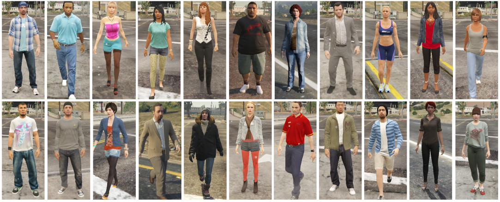

# GPR+: A Large-Scale Synthetic Dataset for Person Re-identification

### [Project Page](https://JeremyXSC.github.io/GPR/) 

### [Previous GPR dataset](https://ieeexplore.ieee.org/stamp/stamp.jsp?tp=&arnumber=9102822) 

[GPR+: A Large-Scale Synthetic Dataset for Person Re-identification](https://JeremyXSC.github.io/GPR/) <br>
 [Suncheng Xiang](https://JeremyXSC.github.io/)<sup>1</sup> <br>
 <sup>1</sup> Shanghai Jiao Tong University



<div align="center">
    
</div> 

## Dataset 
### Some Mainstream Datasets for Person Re-Identification
For GPR+ (for details of the subset GPR+ please refer to the [GPR Homepage](https://JeremyXSC.github.io/GPR/)) :

<center>

| dataset      | IDs     | boxs | cams | weathers | illumination | 
|--------------|---------|------|------|----------|--------------|
| [Market-1501](https://ieeexplore.ieee.org/stamp/stamp.jsp?tp=&arnumber=7410490) | 1,501 | 32,668    | 6      |   -             | -         | 
| [DukeMTMC-reID](https://arxiv.org/pdf/1701.07717.pdf) | 1,404 | 36,411    | 8          | -              | -         | 
| [CUHK03](https://ieeexplore.ieee.org/stamp/stamp.jsp?tp=&arnumber=6909421) | 1,467 | 14,096    | 2          | -              | -         | 
|--------------|---------|------|------|----------|--------------|
| [SOMAset](https://arxiv.org/pdf/1701.03153.pdf) | 50 | 100,000    | 250     |   -             | -         | 
| [SyRI](https://arxiv.org/pdf/1804.10094.pdf) | 100 | 1,680,000    | 100          | -              |     140     | 
| [PersonX](https://arxiv.org/pdf/1812.02162.pdf) | 1,467 | 14,096    | 1,266          | -              | -         | 
| [GPR](https://ieeexplore.ieee.org/stamp/stamp.jsp?tp=&arnumber=9102822) | 754 | 443,352    | 12          |   7           |      8    | 
| GPR+ | 808 | 475,104    | 12          | 7              |     7       | 
</center>


## Citation
If you use original GPR dataset for your research, please cite our [paper](https://ieeexplore.ieee.org/stamp/stamp.jsp?tp=&arnumber=9102822).
```
@inproceedings{xiang2020unsupervised,
  title={Unsupervised Domain Adaptation Through Synthesis For Person Re-Identification},
  author={Xiang, Suncheng and Fu, Yuzhuo and You, Guanjie and Liu, Ting},
  booktitle={ICME},
  pages={1--6},
  year={2020},
  organization={IEEE}
}
```

If you use upgraded GPR+ dataset for your research, please cite our [paper](https://arxiv.org/pdf/2006.07139.pdf).
```
@article{xiang2020attribute,
  title={Attribute analysis with synthetic dataset for person re-identification},
  author={Xiang, Suncheng and Fu, Yuzhuo and You, Guanjie and Liu, Ting},
  journal={arXiv preprint arXiv:2006.07139},
  year={2020}
}
```
### Acknowledgments
We sincerely thank the outstanding annotation team for their excellent work. This work is partially supported by the National Natural Science Foundation of China under Project(Grant No.61977045) and SJTU-SMARCHIT Joint Laboratory of Smart Building.